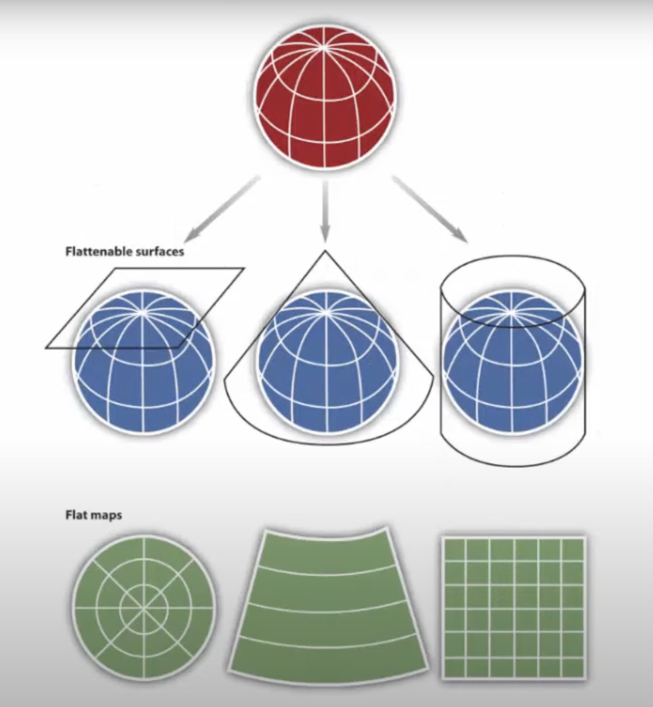

# GeoGal

A geographical game where players must find the shortest path between two municipalities in Galicia, challenging their geographic knowledge and routing skills.

# Game Mechanics

The game challenges players to find the shortest path between two Galician municipalities. Each player guess is evaluated against two key criteria:

1. Solution validation: checking if the proposed route exactly matches the pre-calculated shortest path.
2. Path legitimacy: verifying that the suggested route follows valid municipal connections.

As players submit municipalities, the system provides immediate feedback:

- Correct routes reveal the full solution.
- Users can use hints to find the optimal path but they come with a penalty.

# Development steps

1. Data acquisition in GeoJSON format.
2. Data transformation to standard WGS84 longitude/latitude using `proj4js`.
3. Calculate adjacency map from the GEOJson using `turfjs`.
4. Find the shortest route between two nodes using BFS.
5. Visualize the map using `d3js`.
6. Use DPS to validate user input routes.
7. Add other gameplay mechanics like local storage and daily challenge.

# Data Acquisition

The game's geographic data was obtained from the [Xunta de Galicia Map Center](https://mapas.xunta.gal/es/mapas/informacion-geografica/centro-de-descargas) and was provided in the [GeoJSON](https://geojson.org) format. This format represents geographic features using `JSON`, making it easy to work with and share spatial data. It allows encoding various geographic data structures like points, lines, polygons, and their associated properties in a lightweight, human-readable text format.

## A few words about map projections

The GeoJSON data can be structured using different map projections.

A map projection is the process of transforming a spherical object into a flat map. They are like "lenses" that transform the curved surface of the Earth into a flat 2D surface.

If we imagine a football ball, and we try to break it up and turn it into a flat surface we would see that it's not a perfect rectangle.
A map projection is a mathematical equation that tells a mapping system how to fill in those gaps and populate the entire rectangle. In order to do that, we have to introduce some distorsions. Depending on the projection used, these distorsions might affect areas, shapes, distances, etc.

Depending on the projection, the same location might be represented with slightly different coordinates too. Most projections try to find a sweet spot for these distorsions. All of this allows the representation of geographic features in various coordinate systems depending on the specific use case or region, such as focusing on a small region with high accuracy or visualizing the entire world with a broader perspective.

## Applied transformation

The downloaded data was initially structured using the ESPG:25829 coordinate reference system, which is specific to the Galician region's ETRS89 / UTM zone 29N projection.

To enable integration with Turf.js and facilitate the game's geospatial analysis, the municipal boundary datasets underwent a coordinate transformation process. This implied using `proj4` to convert the original UTM-based coordinates to the standard WGS84 longitude/latitude format, which is the only format supported by Turf. On top of that, the coordinates precision was reduced to 5 decimal places to reduce the size of the data.

Turf.js provides powerful spatial analysis capabilities, transforming these GeoJSON representations into an adjacency map. By utilizing the `booleanIntersects` function, the system identifies which municipalities share borders or touch, creating a network of interconnected regions. This adjacency mapping becomes the foundation for the game's route-finding mechanics.

# Algorithms

- The Breadth-First Search (BFS) algorithm is then used to calculate the shortest route between two nodes of the adjacent map.
- The Depth-First Search (DFS) algorithm is then used to calculate if a certain route input by the user is considered valid.

# Learning resources

- https://en.wikipedia.org/wiki/Depth-first_search
- https://en.wikipedia.org/wiki/Breadth-first_search
- https://omniatlas.com/blogs/stray-maps/football-projections/
- https://www.thetruesize.com

# Tools

- https://geojson.io: get data.
- https://geojson.org: GEOJson format.
- https://d3js.org: JavaScript library to create dynamic visualizations.
- http://proj4js.org: JavaScript library to transform coordinates from one coordinate system to another, including datum transformations.
- https://turfjs.org: Advanced geospatial analysis for browsers and Node.js.
